# RI_TP1_mesures

# Mesures de réseaux d'interaction

Nous allons analyser un réseau de collaboration scientifique en informatique. 
Le réseau est extrait de DBLP et disponible sur [SNAP](https://snap.stanford.edu/data/com-DBLP.html).

GraphStream permet de mesurer de nombreuses caractéristiques d'un réseau. 
La plupart de ces mesures sont implantées comme des méthodes statiques dans la classe [`Toolkit`](https://data.graphstream-project.org/api/gs-algo/current/org/graphstream/algorithm/Toolkit.html). 
Elles vous seront très utiles par la suite.

### Question 1
Commencez par télécharger les données et les lire avec GraphStream. GraphStream sait lire ce format. 
Voir [`FileSourceEdge`](https://data.graphstream-project.org/api/gs-core/current/org/graphstream/stream/file/FileSourceEdge.html) et ce [tutoriel](http://graphstream-project.org/doc/Tutorials/Reading-files-using-FileSource/). Vous pouvez essayer de visualiser le graphe mais pour cette taille ça sera très lent et très peu parlant.

### Question 2
Prenez quelques mesures de base : nombre de nœuds et de liens, degré moyen, coefficient de clustering. 
Quel sera le coefficient de clustering pour un réseau aléatoire de la même taille et du même degré moyen ?

#### Résultats des mesures

- Degré moyen : 6.622
- Coefficient de clustering : 0.632

Le coefficient de clustering pour un nœud *i* dans un réseau aléatoire est donné par la formule
$` C_{i} = \frac{\lt k\gt}{N}`$ 

Dans un réseau aléatoire de même degré moyen que le réseau réel étudié, on obtiendrait $` C_{i} = 2,1004\times 10^{-5}`$


### Question 3
Le réseau est-il connexe ? Un réseau aléatoire de la même taille et degré moyen sera-t-il connexe ?
À partir de quel degré moyen un réseau aléatoire avec cette taille devient connexe ?

- On a pu vérifier que le réseau est connexe en utilisant la méthode `isConnected`.

- Un réseau aléatoire est connexe si le degré moyen respecte la condition suivante : $`\frac{\lt k\gt} {\ln \left( N \right)} \gt   1  `$

La méthode `randIsConnexe` permettant de vérifier si la propriété citée précédemment est serait vérifiée
si le réseau était aléatoire.

- Un réseau aléatoire de même taille devient connexe si le degré moyen est supérieur à 12.666


### Question 4
Calculez la distribution des degrés et tracez-la avec `gnuplot` (ou avec votre outil préféré) d'abord en 
échelle linéaire, ensuite en échelle log-log. Est-ce qu'on observe une ligne droite en log-log ? 
Que cela nous indique ? 
Tracez la distribution de Poisson avec la même moyenne pour comparaison.
Utilisez la commande `fit` de `gnuplot` pour trouver les coefficients de la loi de puissance et tracez-la.

La distribution de degrés $`p_k = \frac{N_k}{N}`$ est la probabilité qu'un nœud choisi au hasard ait 
degré $`k`$. On peut utiliser [`Toolkit.degreeDistribution()`](https://data.graphstream-project.org/api/gs-algo/current/org/graphstream/algorithm/Toolkit.html#degreeDistribution(org.graphstream.graph.Graph)) pour obtenir $`N_k`$ et normaliser 
par la suite :

##### Distribution des degrés en echelle linéaire


En traçant la distribution de degrés en échelle log-log on observe une ligne droite pendant plusieurs 
ordres de grandeur. Cela nous indique une loi de puissance :

    ```math
         p_k = C k^{-\gamma}
    ```

##### Distribution des degrés en echelle log-log


On a $`\gamma = 2.7 \pm 0.04`$

### Question 5
Maintenant, on va calculer la distance moyenne dans le réseau. Le calcul des plus courts chemins entre 
toutes les paires de nœuds prendra plusieurs heures pour cette taille de réseau. C'est pourquoi on va 
estimer la distance moyenne par échantillonnage en faisant un parcours en largeur à partir de 1000 sommets 
choisis au hasard. L'hypothèse des six degrés de séparation se confirme-t-elle ? Est-ce qu'il s'agit d'un 
réseau petit monde ? Quelle sera la distance moyenne dans un réseau aléatoire avec les mêmes caractéristiques ? 
Tracez également la *distribution* des distances. 
Formulez une hypothèse sur la loi de cette distribution.

#### Tests sur le réseau réel
J'ai fait plusieurs essais, la distance moyenne environne 6 à chaque fois, on peut donc dire que l'hypothèse
des six degrés de séparation se confirme sur ce réseau.
La propriété petit-monde est la suivante $`\lt d\gt \simeq \frac{\ln \left( N \right)} {\ln \left( k \right)}`$
pour notre réseau $` \frac{\ln \left( 317080 \right)} {\ln \left( 6.62208890914917 \right)} \simeq 6.7 \simeq \lt d\gt `$
on peut ainsi déduire que ce réseau est un réseau petit-monde.

J'ai choisi de représenter la distribution des distances à l'aide d'un histogramme, car cela m'a paru plus 
parlant étant donné qu'on manipule des valeurs discrètes.

##### Distribution des distances dans le réseau de collaboration
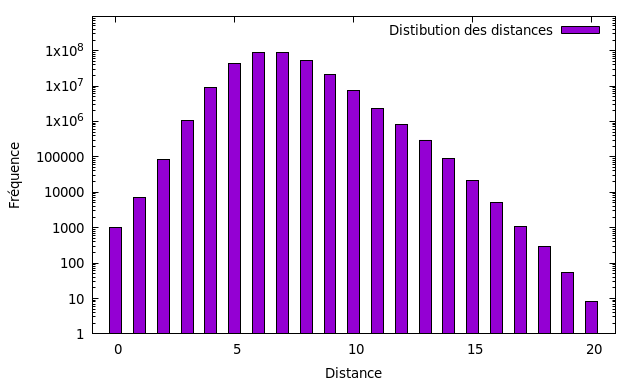

La forme de cloche obtenue s'apparente à une loi de poisson.

#### Pour un réseau aléatoire de même degré moyen
La distance moyenne serait égale à environ : 6.70

### Question 6
Utilisez les générateurs de GraphStream pour générer un réseau aléatoire et un réseau avec la méthode 
d'attachement préférentiel (Barabasi-Albert) qui ont la même taille et le même degré moyen. 
Refaites les mesures des questions précédentes pour ces deux réseaux. Les résultats expérimentaux 
correspondent-ils aux prédictions théoriques ? Comparez avec le réseau de collaboration. 
Que peut-on conclure ?

#### Réseau aléatoire
- Nombre de nœuds 317087
- Nombre de liens 1050289
- Coefficient de clustering 2.751E-5
- Degré moyen 6.624
- Le réseau n'est pas connexe
- Distance moyenne dans le réseau : 6.899

Les résultats obtenus sont trés proches des prédictions théoriques 
calculées plus haut. 

##### Distribution des degrés
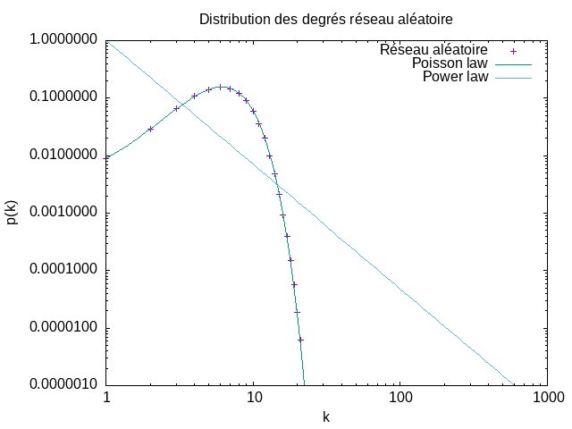
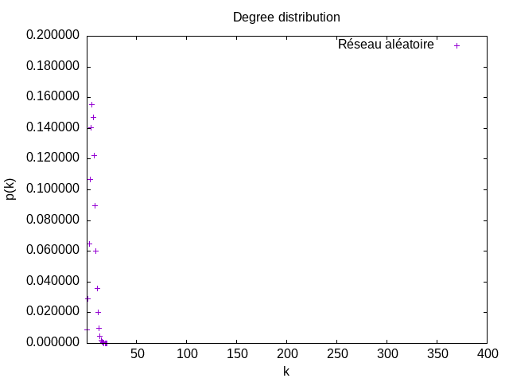


Les résultats confirment bien ce qu'on a vu en cours, dans un réseau aléatoire la distribution des degrés suit une loi de poisson.

##### Distribution des distances 
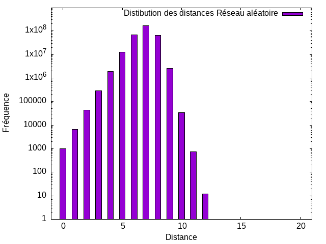


#### Réseau par la méthode d'attachement préférentiel Barabasi-Albert
- Nombre de nœuds 317082
- Nombre de liens 1109289
- Coefficient de clustering 3.885E-4
- Degré moyen 6.624
- Le réseau est connexe
- Distance moyenne dans le réseau : 5.062


##### Distribution des degrés
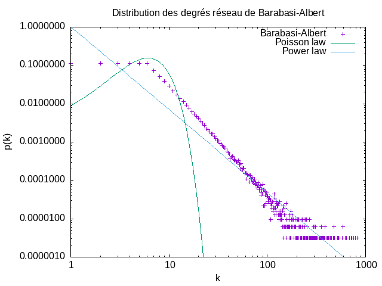
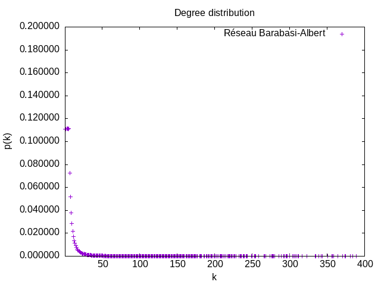

La distribution correspond bien aux prédictions théoriques, elle suit une loi puissance avec une 

##### Distribution des distances
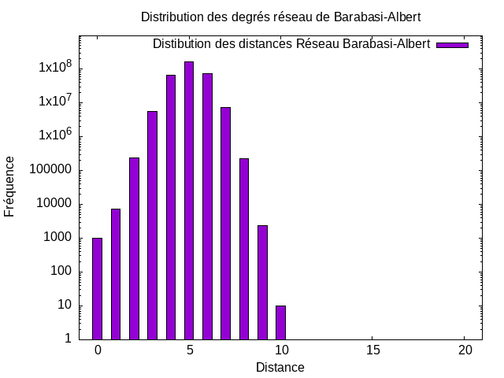


En théorie, la distance moyenne dans le réseau suivant le modèle de Barabasi-Albert serait égale à 4,988 et
devrait être inférieure à celle d'un réseau aléatoire avec les mêmes caractéristiques en raison des hubs présents et qui réduisent les distances entre les nœuds, les résultats de nos 
tests montrent une légère différence.
Le coefficient de clustering est lui estimé théoriquement à 0,0005 et c'est du même ordre des résultats obtenus en pratique.

Si on compare avec les mesures du réseau réel, on remarque qu'on retrouve les propriétés vu en cours les réseaux réels ont un coefficient de clustering relativement élevé.


# Propagation dans les réseaux d'interactions

### Question 1
- Taux de propagation dans le réseau étudié $`\lambda = 2.142`$ 

- Seuil épidémique :
        
  La formule permettant de le trouver est la suivante : $`\lambda_{c} = \frac{\lt k\gt }{\lt k^{2}\gt }`$
  On obtient alors pour notre réseau réel : $`\lambda_{c} = 0.045`$

- Seuil épidémique théorique pour un réseau aléatoire de même degré moyen :
  $`\lambda_{c}  = \frac{1}{\lt k\gt +1}`$
  
  $`\lambda_{c}  = 0.131`$
  
Dans notre réseau réel, le seuil épidémique est nettement inférieur au seuil théorique calculé pour un 
réseau aléatoire, de même degré moyen. Cela indique que le réseau réel est plus vulnérable à la propagation
de virus que le réseau aléatoire, cela s'explique par l'existence de hubs (qui accélèrent la propagation).
  
### Question 2
##### Évolution de la fraction d'inféctés de la population non immunisée pour les trois scénarios

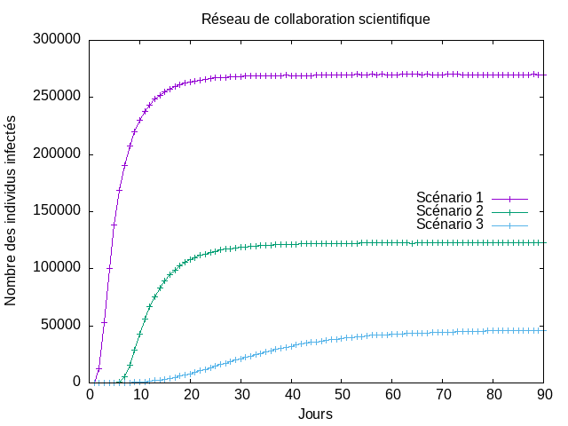

- **Scénario 1 :** c'est vraisemblablement le pire, comme on pouvait s'en douter. La propagation du virus est rapide et il touche un nombre considérable d'individus.
- **Scénario 2 :** la propagation est également rapide, mais seul un tier de la population est contaminé.
- **Scénario 3 :** le virus se propage lentement, et peu de d'individus sont finalement contaminés (environ 1/6).

### Question 3
Le calcul des degrés moyens des groupes 0 et 1 a donné les résultats suivants :
- **Groupe 0 :** 6.6001
- **Groupe 1 :** 18.469
La différence indique que l'immunisation selective nous permet de modifier
la topologie du réseau en ciblant les hubs (la majorité des nœuds sont 
connectés à des hubs).

### Question 4
Le calcul des seuils épidémiques des réseaux modifiés par les 
scénarios 2 et 3 a donné les résultats suivants :
- **Scénario 2 (immunisation aléatoire) :** 0,0463
- **Scénario 3 (immunisation séléctive) :** 0,0927

En comparant avec le seuil du réseau avant modification, on voit bien 
le rôle de l'immunisation séléctive dans le ralentissement de la 
propagation du virus.

L'immunisation aléatoire en revanche, n'accroit pas le seuil épidémique,
la propagation du virus n'est pas ralentie.


### Question 5

#### Réseau Aléatoire
- Degré moyen du groupe 0 : 6.630
- Degré moyen du groupe 1 : 7.628
- Seuil épidémique du réseau modifié suite à l'immunisation aléatoire : 0.131
- Seuil épidémique du réseau modifié suite à l'immunisation séléctive : 0.139


#### Réseau Barabasi-Albert
- Degré moyen du groupe 0 : 7.005
- Degré moyen du groupe 1 : 37.139
- Seuil épidémique du réseau modifié suite à l'immunisation aléatoire : 0.034
- Seuil épidémique du réseau modifié suite à l'immunisation séléctive : 0.135


#### Comparaison des trois réseaux

##### Scénario 1
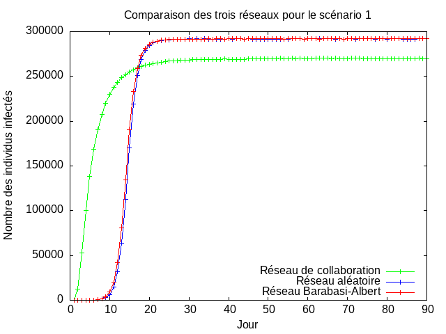

Le nombre d'inféctés atteint un nombre de grandeur similaire pour 
chacun des réseaux, on remarque cependant une propagation plus rapide 
dans le réseau de collaboration et le réseau suivant la méthode 
d'attachement préférentiel, surement en raison de la présence de hubs. 

##### Scénario 2
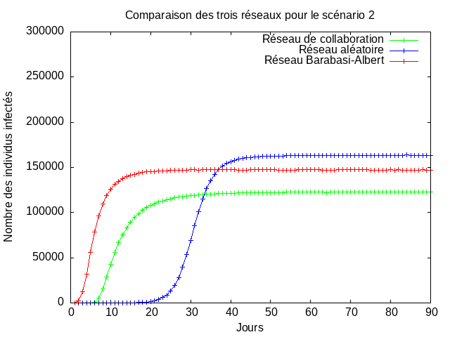

Le nombre d'inféctés est moins important que lors du scénario 1,
la propagation est toujours plus lente du côté du réseau aléatoire, 
on retrouve ensuite le réseau de collaboration suivit de près par le réseau Barabasi-Albert.

##### Scénario 3
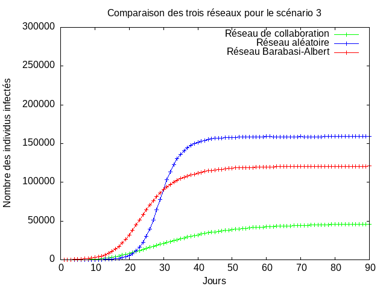

le réseau de Barabasi-Albert enfin une différence plus prononcée dans la vitesse de 
propagation.
L'écart avec le nombre maximal d'inféctés dans le réseau de 
collaboration se creuse d'autant plus, il y en a environ deux à trois fois 
plus dans les deux autres réseaux.


On remarque que le réseau aléatoire présente un nombre d'inféctés supérieur aux autres dans tous les scénarios.

