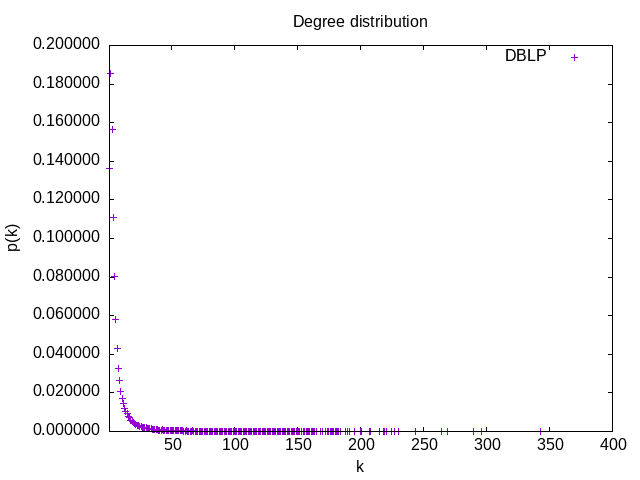
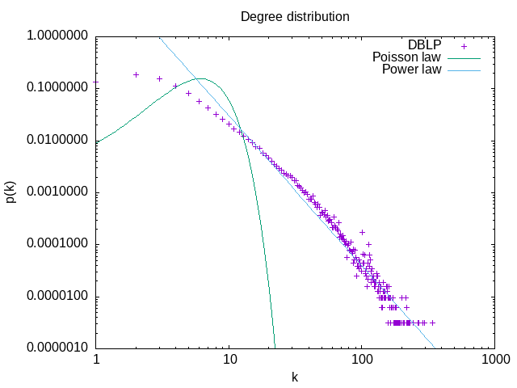

# RI_TP1_mesures

# Mesures de réseaux d'interaction

Nous allons analyser un réseau de collaboration scientifique en informatique. Le réseau est extrait de DBLP et disponible sur [SNAP](https://snap.stanford.edu/data/com-DBLP.html).

GraphStream permet de mesurer de nombreuses caractéristiques d'un réseau. La plupart de ces mesures sont implantées comme des méthodes statiques dans la classe [`Toolkit`](https://data.graphstream-project.org/api/gs-algo/current/org/graphstream/algorithm/Toolkit.html). Elles vous seront très utiles par la suite.

### Question 1
Commencez par télécharger les données et les lire avec GraphStream. GraphStream sait lire ce format. Voir [`FileSourceEdge`](https://data.graphstream-project.org/api/gs-core/current/org/graphstream/stream/file/FileSourceEdge.html) et ce [tutoriel](http://graphstream-project.org/doc/Tutorials/Reading-files-using-FileSource/). Vous pouvez essayer de visualiser le graphe mais pour cette taille ça sera très lent et très peu parlant.

### Question 2
Prenez quelques mesures de base : nombre de nœuds et de liens, degré moyen, coefficient de clustering. Quel sera le coefficient de clustering pour un réseau aléatoire de la même taille et du même degré moyen ?

Le coefficient de clustering pour un nœud *i* dans un réseau aléatoire est donné par la formule
$` C_{i} = \frac{\lt k\gt}{N}`$


### Question 3
Le réseau est-il connexe ? Un réseau aléatoire de la même taille et degré moyen sera-t-il connexe ? À partir de quel degré moyen un réseau aléatoire avec cette taille devient connexe ? 

   - On a pu vérifier que le réseau est connexe en utilisant la méthode `isConnected`.
   
   - Un réseau aléatoire est connexe si le degré moyen respecte la condition suivante : $`\frac{\lt k\gt} {\ln \left( N \right)} \gt   1  `$
   
   La méthode `randIsConnexe` permettant de vérifier si la propriété citée précédemment est serait vérifiée si le réseau était aléatoire.

   - Un réseau aléatoire de même taille devient connexe si le degré moyen est supérieur à 12.666909386951092  


### Question 4
Calculez la distribution des degrés et tracez-la avec `gnuplot` (ou avec votre outil préféré) d'abord en échelle linéaire, ensuite en échelle log-log. Est-ce qu'on observe une ligne droite en log-log ? Que cela nous indique ? Tracez la distribution de Poisson avec la même moyenne pour comparaison. Utilisez la commande `fit` de `gnuplot` pour trouver les coefficients de la loi de puissance et tracez-la.

   La distribution de degrés $`p_k = \frac{N_k}{N}`$ est la probabilité qu'un nœud choisi au hasard ait degré $`k`$. On peut utiliser [`Toolkit.degreeDistribution()`](https://data.graphstream-project.org/api/gs-algo/current/org/graphstream/algorithm/Toolkit.html#degreeDistribution(org.graphstream.graph.Graph)) pour obtenir $`N_k`$ et normaliser par la suite :
   


   En traçant la distribution de degrés en échelle log-log on observe une ligne droite pendant plusieurs ordres de grandeur. Cela nous indique une loi de puissance :

    ```math
         p_k = C k^{-\gamma}
    ```

   
   

   On a $`\gamma = 2.7 \pm 0.04`$
   
### Question 5
Maintenant on va calculer la distance moyenne dans le réseau. Le calcul des plus courts chemins entre toutes les paires de nœuds prendra plusieurs heures pour cette taille de réseau. C'est pourquoi on va estimer la distance moyenne par échantillonnage en faisant un parcours en largeur à partir de 1000 sommets choisis au hasard. L'hypothèse des six degrés de séparation se confirme-t-elle ? Est-ce qu'il s'agit d'un réseau petit monde ? Quelle sera la distance moyenne dans un réseau aléatoire avec les mêmes caractéristiques ? Tracez également la *distribution* des distances. Formulez une hypothèse sur la loi de cette distribution.

   **TODO**
### Question 6
Utilisez les générateurs de GraphStream pour générer un réseau aléatoire et un réseau avec la méthode d'attachement préférentiel (Barabasi-Albert) qui ont la même taille et le même degré moyen. Refaites les mesures des questions précédentes pour ces deux réseaux. Les résultats expérimentaux correspondent-ils aux prédictions théoriques ? Comparez avec le réseau de collaboration. Que peut-on conclure ?

   **TODO**
### Question 7
(*Question bonus*) S'il y a une caractéristique du réseau de collaboration que le modèle de Barabasi-Albert n'arrive pas à reproduire c'est le coefficient de clustering. Est-ce qu'on peut espérer faire mieux avec une variante de la méthode de copie :

    * Le nouveau nœud choisit au hasard un nœud `v`.
    * Ensuite il parcourt tous les voisins de `v` et se connecte à eux avec probabilité `p`.
    * À la fin il se connecte à `v`

   Essayez d'implanter un tel générateur et voir les résultats qu'il donne.

   **TODO**
